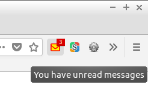
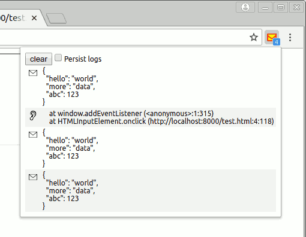

## MessPostage

Notifies you if a site uses the [postMessage API](https://developer.mozilla.org/en-US/docs/Web/API/Window/postMessage). You can install this extension from [its Firefox Add-On page](https://addons.mozilla.org/en-US/firefox/addon/messpostage/).

This extension puts a little envelope in your toolbar. As soon as the site you are visiting adds a message event listener or posts a message, it becomes red:

Clicking this button will shows which messages were sent and where event listeners have been added:

